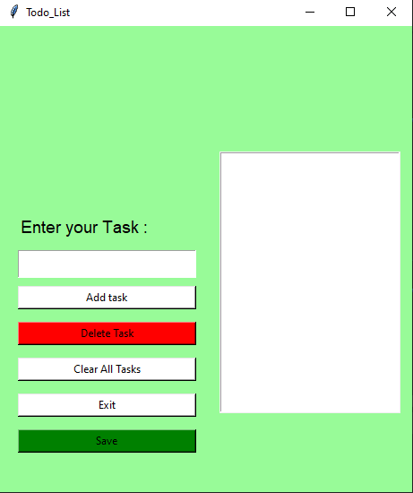
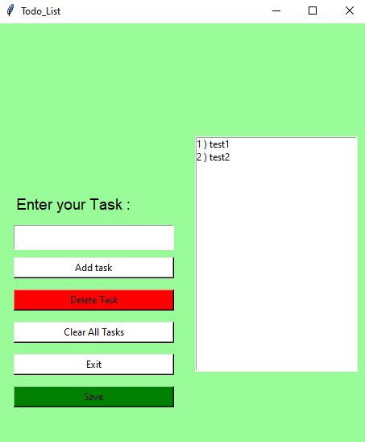

# 📝 Tkinter To-Do List

A simple and user-friendly To-Do List app built using Python's Tkinter library.

## 🔧 Features

- Add tasks
- Mark tasks as completed
- Delete tasks
- Persistent UI
- Save tasks

## 📸 Screenshots

Here are some screenshots of the app in action:






## 📦 Requirements

- Python 3.x
- Tkinter (comes with Python by default)

Install dependencies (if any):

```bash
pip install -r requirements.txt